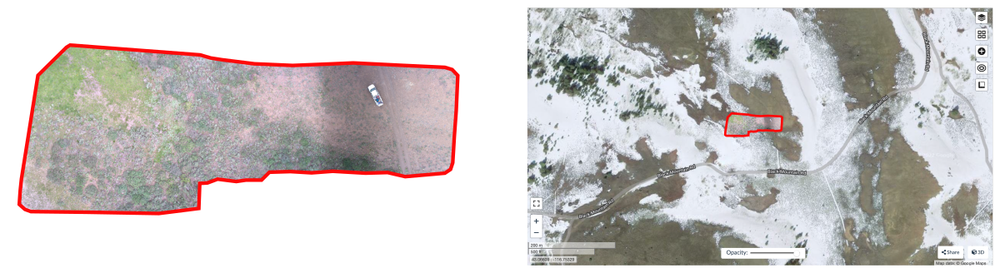

# geo_utils
The collection of small Python-based utilities for geospatial analysis.

---

The **geo_utils** repository houses an evolving collection of **Python utilities tailored for geospatial analysis**. These utilities are **designed to complement photogrammetry analysis using ODM software**, enhancing the robustness of processing pipelines especially **when calculations are executed on an HPC cluster**. As the repository grows, it aims to serve a broader range of geospatial needs while maintaining its core focus on delivering efficient and precise tools.

---

## Table of Contents:

[License](#license)

| tool                       | category       | description |
|----------------------------|----------------|-------------|
|[gcp_images_picker.py](#gcp-images-picker)      | [georeferencing](#georeferencing) | Automated selector for representative GCP images, minimizing manual inspection.|
|[gcp_to_aruco_mapper.py](#gcp-to-aruco-mapper)  | [georeferencing](#georeferencing) | Maps custom GCP IDs to corresponding ArUco marker IDs in imagery based on the distance between GCP coordinates and image GPS.|


## License

```
# Copyright (c) 2023 Aleksandra Badaczewska
#
# GNU GENERAL PUBLIC LICENSE, version 3.0
#
# This program is free software: you can redistribute it and/or modify
# it under the terms of the GNU General Public License as published by
# the Free Software Foundation, either version 3 of the License, or
# (at your option) any later version.
#
# This program is distributed in the hope that it will be useful,
# but WITHOUT ANY WARRANTY; without even the implied warranty of
# MERCHANTABILITY or FITNESS FOR A PARTICULAR PURPOSE.  See the
# GNU General Public License for more details.
#
# You should have received a copy of the GNU General Public License
# along with this program.  If not, see <http://www.gnu.org/licenses/>.
```

# Photogrammetry

## Georeferencing

Georeferencing process results in locating a piece of the landscape visible in the photo in the corresponding geographic destination on the real-world map.



Most photogrammetry software includes a manual geolocation step, where users visually identify markers in extensive image sets, a process that's time-intensive and error-prone. By adopting an automated approach, specifically with the programmatic detection of standardized markers like ArUco codes, the georeferencing process becomes more robust and efficient. **This section provides Python utilities that enhance georeferencing through automatic, high-accuracy GCP reference detection.**

---

### GCP images picker

**Applications:** This script selects the most representative images for Ground Control Points (GCPs) in land surveying projects. It calculates the Euclidean distance of each marker from the center of the image, sorts them in ascending order, and picks the top N images for each marker ID.

**Usage Stage:** This utility is especially useful in the data preparation phase before running photogrammetry analysis (e.g., using ODM software). The script streamlines the image selection process by automatically (programmatically) identifying the most representative photos for each GCP, reducing the need for time-consuming visual inspections. It is especially useful when dealing with datasets that may contain thousands of images.

```
*********************************
Automated selector for representative images with GCP markers.
*********************************

python3 gcp_images_picker.py -h

required/optional arguments:
  -h,                 --help                                  show this help message and exit
  -i DATA_FILE_PATH,  --data-file-path DATA_FILE_PATH    r    path to the data file (4 or 7-column)
  -w IMAGE_WIDTH,     --image-width IMAGE_WIDTH          r    width of the image
  -l IMAGE_HEIGHT,    --image-height IMAGE_HEIGHT        r    height of the image
  -n IMAGES_NUMBER,   --images-number IMAGES_NUMBER      o    number of images to select
  -o OUTPUT,          --output OUTPUT                    o    name of the output file

USAGE:
     gcp_images_picker.py [-h] -i DATA_FILE_PATH -w IMAGE_WIDTH -l IMAGE_HEIGHT [-n IMAGES_NUMBER] [-o OUTPUT]
Example:
     python gcp_images_picker.py -i <data_file> -w <image_width> -h <image_height> -n <images_number>
```


```
python3 <your_path>/geo_utils/TOOLS/gcp_images_picker.py -i markers_found.txt -w 6000 -l 4000 -n 10
```

---

### GCP to ArUco mapper

**Applications:** This script identifies which custom GCP IDs match with ArUco marker IDs present in the images. It is intended to create a mapping between images and their corresponding GCPs, providing a reliable set of control points for georeferencing.

**Usage Stage:** This script is typically employed during the initial stages of a land surveying project, after capturing the images and prior to photogrammetry processing. The tool is crucial when you have the recorded reference GCP coordinates with custom IDs that differ from the ArUco marker IDs, and you need to establish which custom IDs correspond to which ArUco marker IDs.

```
*********************************
Maps custom GCP IDs to corresponding ArUco marker IDs in imagery (uses WGS84 datum).
*********************************

python3 gcp_to_aruco_mapper.py -h

required/optional arguments:
  -h,               --help                              show this help message and exit
  -g GCP_FILE,      --gcp-file GCP_FILE            r    path to the GCP file
  -i IMAGERY_PATH,  --imagery-path IMAGERY_PATH    r    path to the imagery directory
  -z ZONE,          --zone ZONE                    r    UTM Zone
  -o OUTPUT,        --output OUTPUT                o    path to the output file
  -d MAX_DIST,      --max_dist MAX_DIST            o    distance threshold in meter

USAGE:
     gcp_to_aruco_mapper.py [-h] -g GCP_FILE -i IMAGERY_PATH -z ZONE [-o OUTPUT] [-d MAX_DIST]
Example:
     python gcp_to_aruco_mapper.py -g <gcp_file> -i <imagery_dir> -z 11 -o <output_file> -d 50
```


```
python3 <your_path>/geo_utils/TOOLS/gcp_to_aruco_mapper.py -g gcp_list.txt -i "./" -z 11 -o out -d 50 > err
```

---
